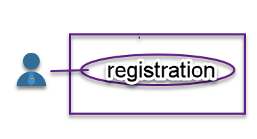

1. use case - registration

1. Rules
    - business rules: The user's password must have more than five characters
    - application rules: The system receives the user name and password, validates if the user doesn't exist, and saves the new user along with the creation time
1. Entity layer
    - interface
        - interface User
        - interface UserFactory
    - implementation
    - unit testing
        - password length vaildation
1. Use case
    - UserRegisterInteractor
        - all steps about the use case (user registration)
        ``` java
        public UserResponseModel create(UserRequestModel requestModel) {
        if (userDsGateway.existsByName(requestModel.getName())) {
            return userPresenter.prepareFailView("User already exists.");
        }
        User user = userFactory.create(requestModel.getName(), requestModel.getPassword());
        if (!user.passwordIsValid()) {
            return userPresenter.prepareFailView("User password must have more than 5 characters.");
        }
        LocalDateTime now = LocalDateTime.now();
        UserDsRequestModel userDsModel = new UserDsRequestModel(user.getName(), user.getPassword(), now);

        userDsGateway.save(userDsModel);

        UserResponseModel accountResponseModel = new UserResponseModel(user.getName(), now.toString());
        return userPresenter.prepareSuccessView(accountResponseModel);
        }
        ```
    - The boundaries are contracts defining how components can interact. 
        - The input boundary exposes our use case to outer layers.
        - The output boundaries for making use of the outer layers


Ref: https://www.baeldung.com/spring-boot-clean-architecture
