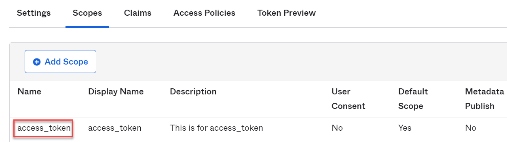
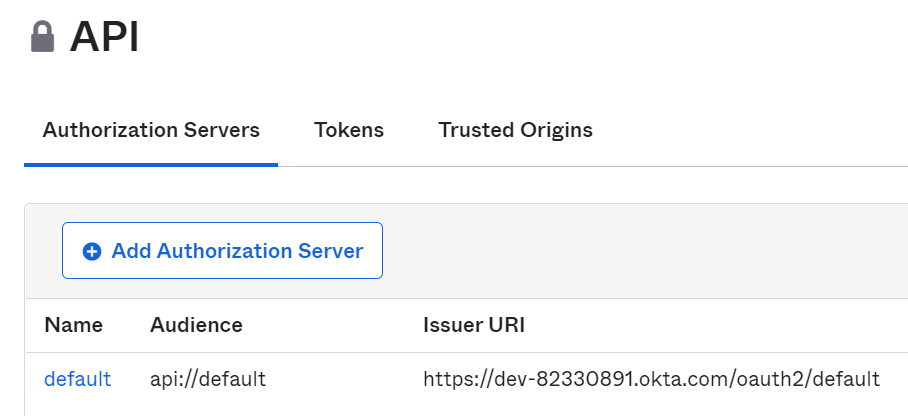

# okta
ref: https://developer.okta.com/blog/2018/02/01/secure-aspnetcore-webapi-token-auth
- When handling authentication for a server-to-server API, you really only have two options: HTTP basic auth or OAuth 2.0 client credentials.
- Create an application on OKta
- Add new scope "access_token"  ref: https://developer.okta.com/docs/guides/customize-authz-server/create-scopes/
## Api Client:
- OAuth 2.0 client credentials
- get token from Okta
```java
var client = new HttpClient();
var client_id = this.oktaSettings.Value.ClientId;
var client_secret = this.oktaSettings.Value.ClientSecret;
var clientCreds = System.Text.Encoding.UTF8.GetBytes($"{client_id}:{client_secret}");

client.DefaultRequestHeaders.Authorization = new AuthenticationHeaderValue("Basic", System.Convert.ToBase64String(clientCreds));
var postMessage = new Dictionary<string, string>();
postMessage.Add("grant_type", "client_credentials");
postMessage.Add("scope", "access_token");
var request = new HttpRequestMessage(HttpMethod.Post, this.oktaSettings.Value.TokenUrl)
{
    Content = new FormUrlEncodedContent(postMessage)
};
```
You must add the access_token on Okta


## Api
- validate the access token
  - call the Okta API's introspect endpoint
  - validate the token locally
  - install package ```Microsoft.AspNetCore.Authentication.JwtBearer```
  - enable JWT-based authentication
``` java 
services.AddAuthentication(options =>
{
    options.DefaultScheme = JwtBearerDefaults.AuthenticationScheme;
})
.AddJwtBearer(options =>
{
    options.Authority = "https://dev-82330891.okta.com/oauth2/default";
    options.Audience = "api://default";
    options.RequireHttpsMetadata = true;
});
```
The above setting must match the setting on Okta


## Read configuration values into C# object
1. define variables on appsettings.json
``` json
{
 "Okta": {
    "TokenUrl": "https://{yourOktaDomain}/oauth2/default/v1/token",
    "ClientId": "{clientId}",
    "ClientSecret": "{clientSecret}"
  }
}
```
2. declare class OktaSettings
```java
namespace app.Models
{
    public class OktaSettings
    {
        public string TokenUrl { get; set; }
        public string ClientId { get; set; }
        public string ClientSecret { get; set; }
    }
}
```  
3. add this new object to the services that can be injected by adding it to the ConfigureServices() method in the Startup.cs file. 
``` Java
 services.Configure<OktaSettings>(Configuration.GetSection("Okta")); 
```
4. get the oktaSettings injected from the application services
``` java
    private readonly IOptions<OktaSettings> oktaSettings;
    public OktaTokenService(IOptions<OktaSettings> oktaSettings)
    {
        this.oktaSettings = oktaSettings;
    }
```   
